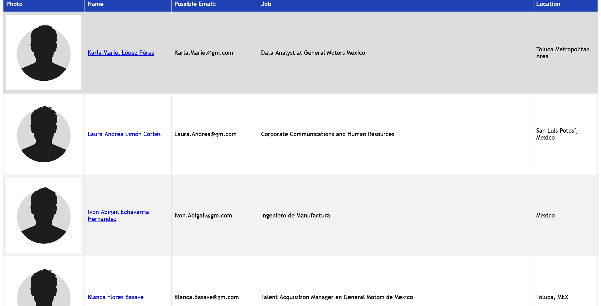

<p align="center">

</p>

# Disclaimer

* The project is to be used for educational and testing purposes only.

# Authors

Gideon Kaiyian - https://github.com/Giddy-K

Contributors:

Feel free to contribute and add your socials, github profile or name here...

# Installation
```
git clone https://github.com/Giddy-K/LinkedScope.git
cd LinkedScope
pip install -r requirements.txt
```

# Configuration

1. Copy `LinkedScope.cfg.example` to `LinkedScope.cfg`
2. Add your LinkedIn `li_at` session cookie (recommended) — find it in browser DevTools → Application → Cookies → linkedin.com
3. Add your Hunter.io API key (optional, used for email prefix auto-detection)

# Usage

1. Fill in `LinkedScope.cfg`
2. Run `LinkedScope.py` and follow the prompts (or use flags below)

```
python LinkedScope.py -u "Company Name" -o outputfilename
```

# Change Log

## v2.0 - June 2026
* Renamed project from LinkedInt to LinkedScope
* Migrated to LinkedIn's current GraphQL API (old Voyager cluster endpoint was removed)
* Added `li_at` session cookie authentication (automated login no longer works due to JS-rendered login page)
* Fixed `login()` crash on startup
* Fixed broken HTML table rows and CSV output
* Fixed Unicode banner crash on Windows
* Updated credits

## v1.0
* Fixed the authentication flow
* Fixed Hunter API demo key - removed
* Added better looking missing image value for profiles with no photo
* Embedded all images into the HTML file to allow for offline viewing
* Constrain to company filters
* Addition of Hunter for e-mail prediction

# Example

Using General Motors as the target as they have a bug bounty program.

```
██╗     ██╗███╗   ██╗██╗  ██╗███████╗██████╗ ███████╗ ██████╗ ██████╗ ██████╗ ███████╗
██║     ██║████╗  ██║██║ ██╔╝██╔════╝██╔══██╗██╔════╝██╔════╝██╔═══██╗██╔══██╗██╔════╝
██║     ██║██╔██╗ ██║█████╔╝ █████╗  ██║  ██║███████╗██║     ██║   ██║██████╔╝█████╗
██║     ██║██║╚██╗██║██╔═██╗ ██╔══╝  ██║  ██║╚════██║██║     ██║   ██║██╔═══╝ ██╔══╝
███████╗██║██║ ╚████║██║  ██╗███████╗██████╔╝███████║╚██████╗╚██████╔╝██║     ███████╗
╚══════╝╚═╝╚═╝  ╚═══╝╚═╝  ╚═╝╚══════╝╚═════╝ ╚══════╝ ╚═════╝ ╚═════╝ ╚═╝     ╚══════╝

Version: 2.0 - June 08, 2026
Author: Gideon Kaiyian @Giddy-K

[*] Enter search Keywords (use quotes for more precise results)
"General Motors"

[*] Enter filename for output (exclude file extension)
generalmotors

[*] Filter by Company? (Y/N):
Y

[*] Specify a Company ID (Provide ID or leave blank to automate):


[*] Enter e-mail domain suffix (eg. contoso.com):
gm.com

[*] Select a prefix for e-mail generation (auto,full,firstlast,firstmlast,flast,firstl,first.last,fmlast,lastfirst,first):
auto

[*] Automatically using Hunter IO to determine best Prefix
[!] {first}.{last}
[+] Found first.last prefix
```

Output (HTML):


